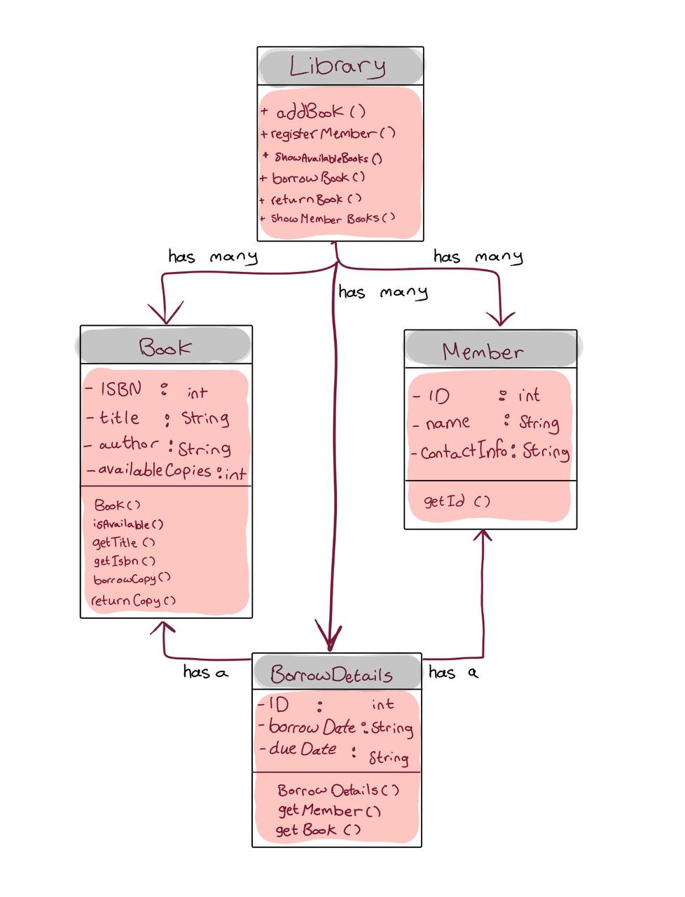
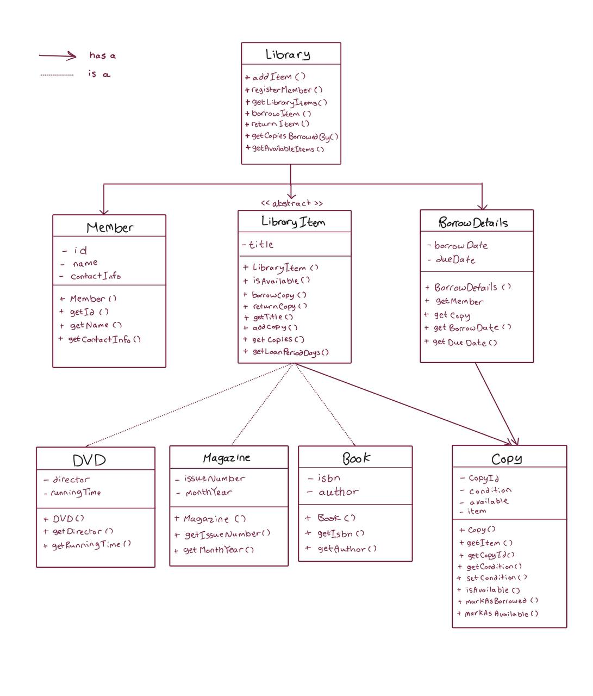

## Analyze the requirements

>> For Milestone 1:

1. **Entities/classes**

- Library => Responsible for basic operations, such as adding new books or members.
- Book => It holds the book's information.
- Member => It records information about who borrows books from the library.
- BorrowDetails => It contains lending information, such as the borrowing date and the due date, to handle the borrowing process.

2. **Relationships**

- A Member can have many Loans.
- A book has many physical Copies.

3. **Business rules**

- A Member can borrow a maximum of 5 books at once.
- The borrowing term ends after 14 days from the date of the loan.
- A copy of a book cannot be borrowed by several members at the same time.
- A Member can borrow a book only if at least one physical copy is available.
- A returned book copy becomes available for another member to borrow.

4. **Assumptions**

- A Member cannot borrow any book before joining the library.
- I assume that all borrowed books are returned on or before the due date.
- The system uses the current system date as the borrow date.

5. **Questions**

- What happens if the borrowing term ends before the member returns the book?
- Can the member buy books too?
- Should I record the member's information even if they come without borrowing any book?

6. A simple **class diagram**

- 

## Analyze the requirements

>> For Milestone 2:

1. **Entities/classes**

- Library => Responsible for basic operations, such as adding new books or members.
- LibraryItem => Contains the common attributes and methods for any item in the library, such as the title.

  - Book => Represents a library item and holds the book's information.
  - Magazine => Represents a library item and holds the magazine's information.
  - DVD => Represents a library item and holds the DVD's information.

- Copy => Represents one physical copy of a library item and stores its copy ID and condition.
- Member => Records information about who borrows books from the library.
- BorrowDetails => Contains lending information, such as the borrowing date and due date, to handle the borrowing process.

2. **Relationships**

- A Loan belongs to one Member.
- A Loan refers to one Copy, not directly to a LibraryItem.
- An item has one or more physical Copies.
- A Copy belongs to one LibraryItem.
- A Library has many LibraryItems.
- A Library has many Members.

3. **Business rules**

- A Member can borrow a maximum of 5 items at once, counting books, magazines, and DVDs together.
- The borrowing term ends after a certain number of days from the date of the loan, according to the item type (14 for books, 7 for magazines, and 3 for DVDs).
- A copy of an item cannot be borrowed by several members at the same time.
- A Member can borrow an item only if at least one physical copy is available.
- A returned item copy becomes available for another member to borrow.
- Each physical copy has a condition: new, good, or worn. Its condition can be updated when the copy is returned damaged.

4. **Assumptions**

- A Member cannot borrow any item before joining the library.
- I assume that the system does not apply fines for overdue items.
- The system uses the current system date as the borrow date.

5. **Questions**

- What happens if the borrowing term ends before the member returns the item?
- Can a worn copy be borrowed again, or should it be removed?
- Should I record the member's information even if they come without borrowing any item?

6. A simple **class diagram**

- 

### **Changes from Milestone 1**

>> In Milestone 2, the system became able to support different types of library items, including Books, Magazines, and DVDs.

>> An abstract `LibraryItem` class was introduced to contain shared information and behavior, such as the title and copies.

### **Abstract class or interface?**

1. We chose an abstract class for `LibraryItem` because Books, Magazines, and DVDs share common data and behavior.

2. The abstract class allows us to store common fields and implemented methods in one place. We also use an abstract `getLoanPeriodDays()` method because each item type can have a different loan period, so each subclass must provide its own implementation.

3. An interface is better for a capability or behavior. If we used an interface for `LibraryItem`, each item would need to manage its own fields and common methods, which would cause duplicated code.